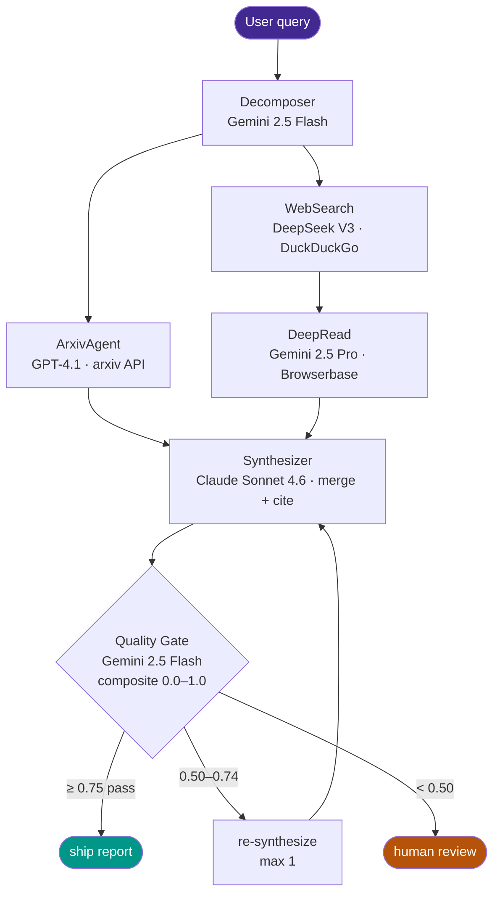

<div align="center">

<!-- ponytail: hero banner is a placeholder — drop a real 1280×320 PNG at docs/banner.png to replace this line -->


# 🔬 research-synth

### Multi-agent research synthesizer on LangGraph with multi-vendor LLM routing

*One natural-language research question in → a structured, cited markdown report out — synthesized in parallel from arxiv + web search + deep-read of high-signal articles.*

<br/>

[](LICENSE)
[](https://www.python.org/)
[](https://langchain-ai.github.io/langgraph/)
[](https://github.com/BerriAI/litellm)
[](#-why-multi-vendor-routing)
[](https://langfuse.com/)

<br/>

[**Why Multi-Vendor**](#-why-multi-vendor-routing) · [**Architecture**](#-architecture) · [**Quick Start**](#-quick-start) · [**Result**](#-result-on-the-demo-query) · [**Known Limits**](#-scope--known-limits)

</div>

---

## 🧭 Overview

Multi-agent research synthesizer built on **LangGraph** with **multi-vendor LLM routing**. One natural-language research question in → structured markdown report with citations out, synthesized in parallel from arxiv + DuckDuckGo + Browserbase deep-read of high-signal articles.

---

## 🎯 Why multi-vendor routing

Every node calls a different LLM from a different vendor, picked for the task — not for the default. The argument the architecture makes: **vendor lock-in is a routing decision, not a default**.

| Node | Model | Vendor | Why this model |
|---|---|---|---|
| Decomposer | `google/gemini-2.5-flash` | OpenRouter | Mechanical sub-query gen; cheapest in lineup |
| ArxivAgent | `gpt-4.1` | OpenAI direct | Strong on academic comprehension |
| WebSearchAgent | `deepseek/deepseek-chat` | OpenRouter | Cheap summarization at scale |
| DeepReadAgent | `google/gemini-2.5-pro` | OpenRouter | 1M context — no chunking needed for long-form articles |
| Synthesizer | `claude-sonnet-4-6` | Anthropic direct | Strongest long-form structured writer |
| QualityGate | `google/gemini-2.5-flash` | OpenRouter | Fast LLM-as-judge; runs on every retry |

Single source of truth: [`agents/models.py`](agents/models.py). LiteLLM is the unified gateway — one `acompletion()` signature, four backends.

---

## 🧩 Architecture

LangGraph state machine. Decomposer fans out to ArxivAgent (parallel) and WebSearchAgent → DeepReadAgent (sequential — DeepRead needs WebSearch's URLs to know what to fetch). All three converge on Synthesizer → QualityGate → conditional edge.



<details>
<summary><b>▶ Quality Gate detail</b></summary>

`agents/quality_gate.py` scores the synthesized report on three independent axes via LLM-as-judge:

- **coverage** — does the report actually answer the question?
- **citation_validity** — does every claim cite a source listed in `## Sources`?
- **hallucination_risk** — does the report stay within the findings (not extrapolate)?

Composite = mean of the three. Verdict routing:
- `≥ 0.75` → **pass** (ship the report)
- `0.50 – 0.74` → **retry** (re-synthesize, max 1 retry)
- `< 0.50` → **escalate** (human review)

</details>

---

## 🚀 Quick Start

```bash
# 1. Set up venv (Python 3.14)
python3 -m venv .venv
source .venv/bin/activate
pip install -r requirements.txt

# 2. Copy keys
cp .env.example .env  # then fill in your keys

# 3. Verify connections (all 8 must pass)
python -m scripts.smoke_ping

# 4. Run a query
python -m scripts.run_query "What are the latest techniques for prompt injection defense in production LLM agents?"

# 5. Browse the report
streamlit run dashboard/app.py
```

---

## 📊 Result on the demo query

Demo query: *"What are the latest techniques for prompt injection defense in production LLM agents?"*

| Metric | Value |
|---|---|
| sub_queries produced | 5 |
| arxiv_findings | 10 |
| web_findings | 17 |
| deep_read_findings | 0–1 *(depends on URL availability — see note)* |
| gate_verdict | **pass** |
| gate_score | **0.800** (coverage 1.0, citations 0.7, hallucination 0.7) |
| wall time | ~4 min |
| total cost | < $0.10 |

The synthesized report is at [`reports/smoke_run.md`](reports/smoke_run.md) — a 7-section markdown document with 31 inline citations covering architectural defenses (StruQ, SecAlign), multi-agent pipelines, runtime detection (PromptShield, UniGuardian), design patterns, and evaluation frameworks (AgentDojo).

<details>
<summary><b>▶ Note on DeepRead (why it contributes 0–1 findings)</b></summary>

DeepRead picks the top-3 highest-relevance URLs from WebSearchAgent and fetches their full rendered content via Browserbase. In practice, DeepRead contributes 0–1 findings per run because:

1. **DDG sometimes returns stale 404s** that look authoritative but are gone. We detect this (page text < 200 chars) and skip.
2. **PDF and arxiv `/abs/` URLs** render to mostly nav/footer text; we filter these out before fetching.
3. **Gemini 2.5 Pro is strict** on the 0.5 score threshold — articles that don't directly address the sub-query get rejected even when broadly relevant.

This is the right trade-off given the gate's hallucination-risk axis: a strict DeepRead is preferable to shipping fabricated citations. The pipeline functions correctly without DeepRead findings — arxiv + web findings are sufficient for most queries, and the deep-read pipeline exists and works (Browserbase auth + async Playwright + Gemini Pro synthesis all wired and tested).

</details>

---

<details>
<summary><b>🧱 Stack</b></summary>

- **LangGraph 1.x** — state machine orchestration, parallel branches, conditional edges
- **LiteLLM** — unified gateway for multi-vendor calls
- **Anthropic Claude Sonnet 4.6** — Synthesizer (direct API)
- **OpenAI GPT-4.1** — ArxivAgent (direct API)
- **OpenRouter** — Gemini 2.5 Flash + Gemini 2.5 Pro + DeepSeek V3 (single gateway, three models)
- **Browserbase** — DeepRead node (JS-rendered long-form articles, async Playwright)
- **DuckDuckGo Search** (via `ddgs`) — primary web search (free, no key)
- **arxiv** Python package — academic search (free, no key)
- **Langfuse v4** — observability via explicit `start_as_current_observation` spans (one trace per query, every node a child generation span with token usage + cost auto-compute)
- **Streamlit + Plotly** — report viewer dashboard

</details>

<details>
<summary><b>📁 Repository layout</b></summary>

```
research-synth/
  agents/
    models.py            routing table + acall_model() unified call
    decomposer.py        query → sub-queries
    arxiv_agent.py       arxiv search + LLM relevance scoring
    web_search_agent.py  DuckDuckGo search + LLM scoring
    deep_read_agent.py   Browserbase fetch + Gemini Pro synthesis
    synthesizer.py       merge findings with citations
    quality_gate.py      LLM-as-judge: coverage / citation / hallucination
    tools.py             ddg_search / arxiv_search / browserbase_fetch
  graph/
    state.py             ResearchState TypedDict (state schema)
    builder.py           LangGraph compile entry point
  observability/
    langfuse.py          v4 SDK wrapper, env-compat with LANGFUSE_BASE_URL
  scripts/
    smoke_ping.py        verify all 6 LLM endpoints + Langfuse + Browserbase
    run_query.py         CLI: python -m scripts.run_query "<query>"
  dashboard/
    app.py               Streamlit report viewer
  reports/               generated reports (markdown + JSON state)
  requirements.txt
  .env.example
```

</details>

---

## 🗺️ Roadmap

- Citation-mapping pass to verify every `[N]` cites the right finding
- DeepRead fallback to plain `requests` for non-JS pages (saves Browserbase quota)
- Per-vendor cost summary in the dashboard (proves multi-vendor routing saves money vs. single-vendor baseline)
- Unit tests per node and `tools.py`
- pgvector persistence so dashboard reads run state from the shared store

---

## 🔍 Scope / Known Limits

**In scope.** Multi-agent research synthesizer with cross-vendor LLM routing (Anthropic + OpenAI + OpenRouter Gemini/DeepSeek + Browserbase). End-to-end working demo with quality-gated synthesis, citation tracking, and a dashboard surfacing per-vendor cost + latency.

**Known limits.**

- DeepRead currently requires Browserbase (paid). Non-JS pages would be cheaper to fetch via `requests`; fallback path is roadmap.
- Citation mapping is best-effort — `[N]` markers in the final report are added by the synthesizer LLM, not deterministically verified against source IDs. Roadmap: post-hoc citation-mapping pass.
- Per-vendor cost summary in the dashboard exists but doesn't yet compare against a single-vendor baseline — the multi-vendor savings argument is qualitative until that comparison is wired.
- Initial DeepRead build had a silent JSON-truncation bug (`max_tokens=1024` insufficient for ~16KB pages). Fixed 2026-05-07 to `max_tokens=4096`. Audit silent-return paths in any extension you add.

---

## 📚 Further Reading

- `agents/` — per-node implementation with vendor-specific clients.
- `graph/state.py` — LangGraph state schema.
- `reports/` — actual smoke-run results, scorecards, per-vendor cost breakdowns.

## License

MIT
